Compu Market - Juan Ezequiel Roclaw

En este proyecto realizo el ecommers de una tienda que vende productos de informatica, se vende desde pc armadas hasta hardware separados.

Lo que se hizo:

1.  Se creo un nueva app ejecutando "create-react-app nombre-de-app"
2.  Una ves creado instale boostrap para el diseño del mismo "npm install react-bootstrap bootstrap"
3.  Cree los componentes y el container que va a ser parte del aplicativo
3.A La carpeta component esta compuesta por 
    a.  CartWidget: es el carrito
    b.  Items: son todas las componetes que se solicita para el item
    c.  NavBar: es el navegador del sitio
3.B La carpeta Container tiene los elemimando de container del sitio, en este caso los componetes de listado y detalle de items
4.  Se utilizo hooks y promesas para muestreo de datos, en ItemListContainer hay una constante que simula ser los datos rescatados de una base o Api, contiene una promesa y un retraso de 2 segundo como una simulacion de error de navegacion.
5.  Una ves que se cargaron los datos los mismo son enviados a ItemList que a traves de un map cargan un contenedor de informacion llamado Items
6. Todo lo dicho anteriormente se puede observar en el inicio del sitio, si uno quiere navegar por el sitio puede ir a las categorias y seleccionalas, las mismas estan dirigidas a ItemsListContainer con la diferencia que al ir a la categoria en el componente se filtra por la categoria selecionada.
7. En el caso de ver de forma individual cada items, se puede navegar haciendo click en el boton detalles, el mismo envia el id y se direcciona a ItemDetailContainer
8. En ItemDetailContainer se lo que se hace es realiza una simulacion igual a ItemListContainer con la diferencia que se filtra por el id del item, para enviar ese dato a ItemDetail y mostrar el detalle del item
9. Tanto en Items como en ItemsDetail se llama a ItemsCount que son los botones que agregan a quitan las cantidad de productos que desea comprar dependiendo del stock cargado en cada item.
10. Toda la navegacion nombrada en los puntos anteriores es gracia a la instalacion "npm install  react-router-dom"

14/05/2021 - Entrega de la clase 5 CartContext - Desafio: Sincronizar counter

Lo que se hizo fue crear la carpeta context y dentro de la misma crear cartContext.js la misma tiene cartContext y un provider. Aca realizo toda la accion de compra:
1 - Añado un nuevo item al carrito
2 - si ya existe lo sumo
3 - verifico antes de sumarlo si supera la cantidad del stock, si es asi mando un mensaje de error y no lo sumo.
4 - Suma el total a abonar por item y la cantidad que desea comprar del mismo
5 - suma la cantidad del total de la compra
6 - puedo eliminar por item
7 - puedo vaciar el carrito

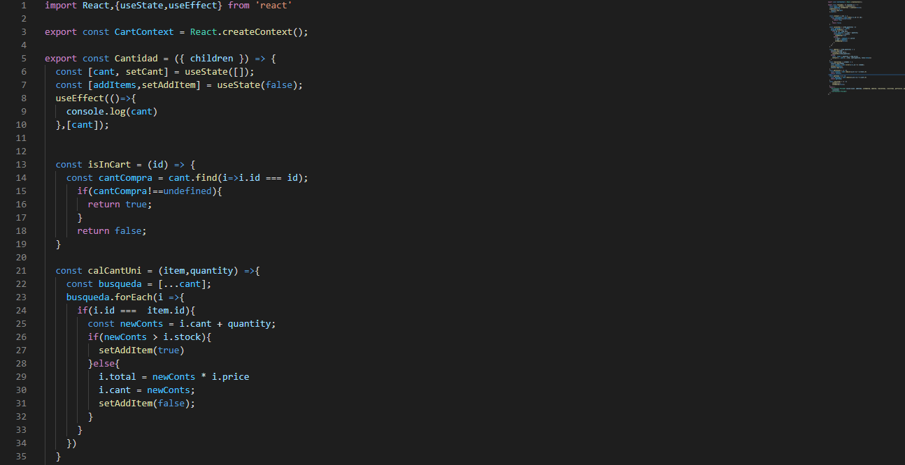

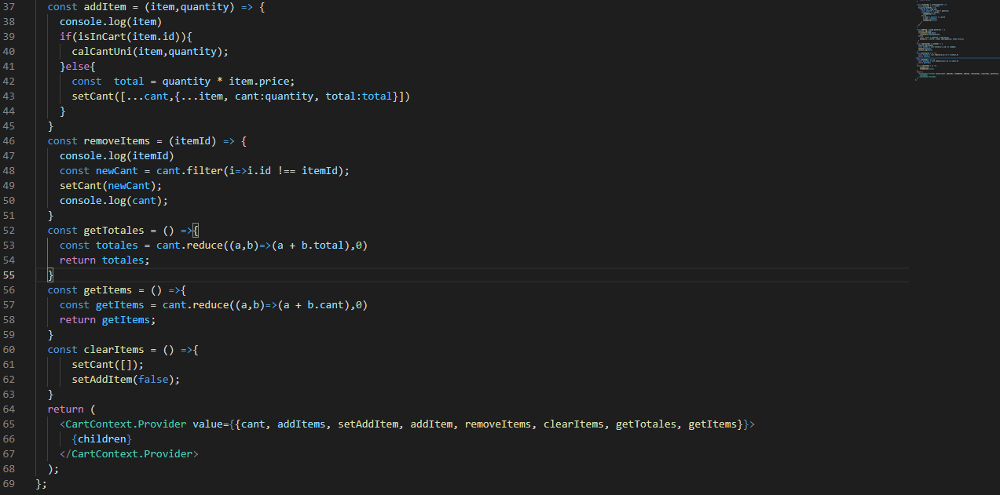

Luego creamos la interacion en ItemDetailContainer donde recibimos de cartContext la accion de agregar, hook addItems que verifica a la hora de comprar y el producto ya fue ingresado anteriormente al carrito, que no supere el stock.

Luego mando esas acciones a ItemsDetails, y de luego a ItemsCounts. En ItemsDetails si agrego un producto al carrito me cambia los botones de compra por un boton que te direcciona al carrito.

En Cart cree un table que mapea el array de compras, recibe el array armando en cartContext, y las acciones Eliminar de forma individual por item y borrar todo, ademas recibe el total a pagar el carrito.

22/05/2021 - Entrega de la clase 6 Desafío: Cart View - Desafío: Item Collection

Lo que hice fue relacionar con la cuenta Firebase, cree categorias e items, relacione categoria con items y los datos de ambas colecciones son los que trabaja el sitio.

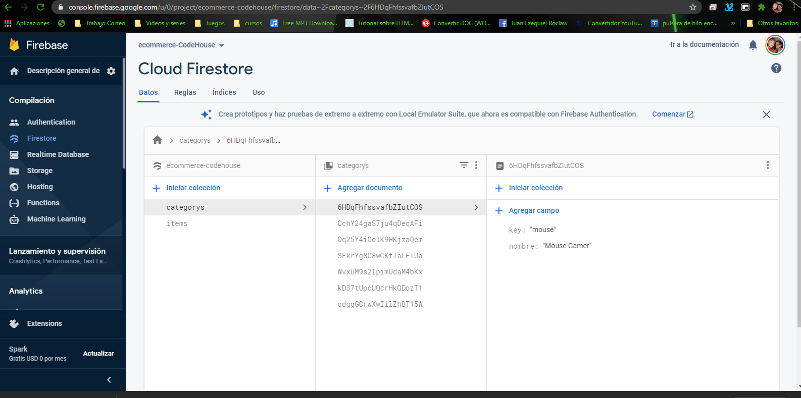

Cree el archivo firabase.js que se encuentra a nivel src, el mismo tiene los datos de conexion a la base.

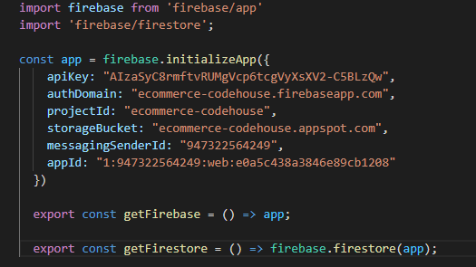

Despues creer en la carpeta context el archivo cartFirabase.js, ese archivo tiene todos los formar de conexion a las colecciones del mi base, contiene el de categoria, el de todos los items, los filtrados por categoria y el item individual

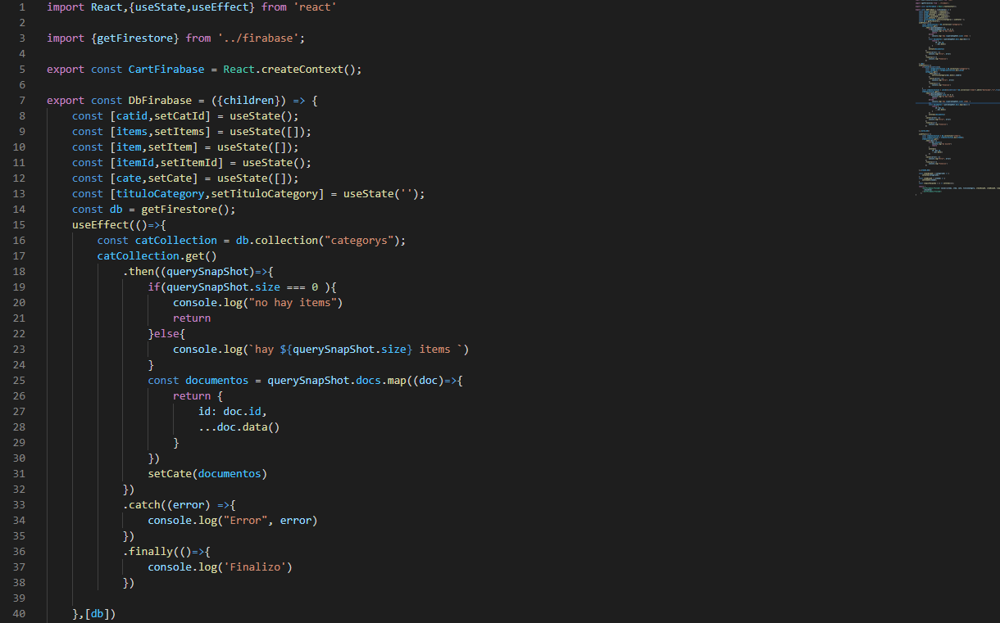

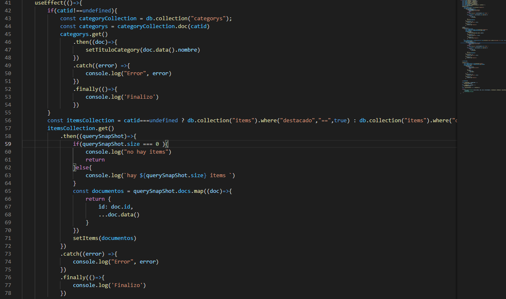

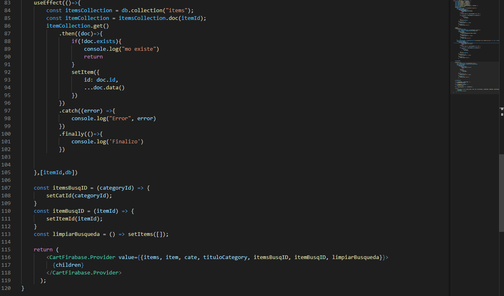

Despues saque todo lo que carga de forma harcodeada de datos y le implemente la llamada desde el cartFirabase, en los containers Detalle items y List items

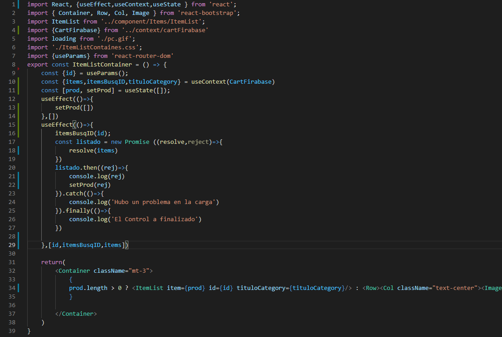

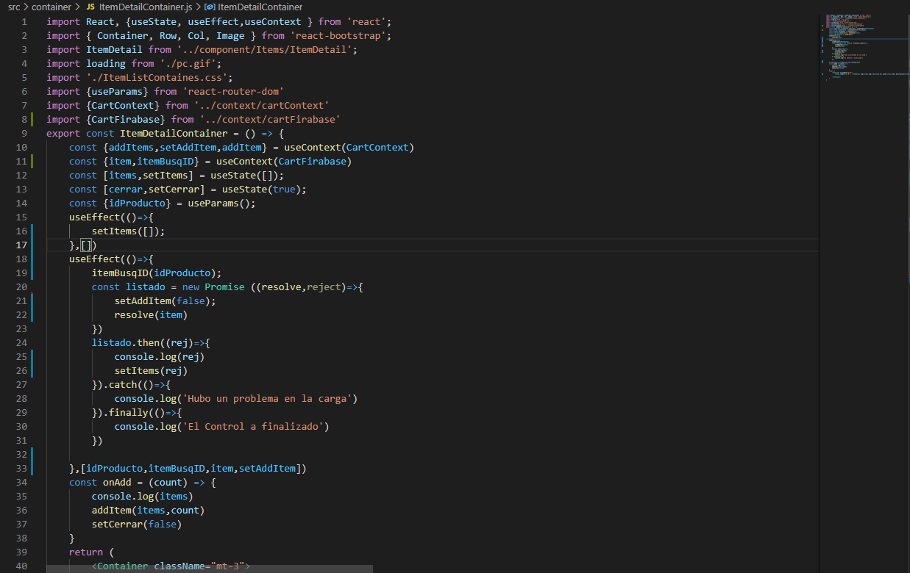

Cree el container category que lo que hace es sacar un listado de categorias de firabes y lo muestra como opciones de menu para la navegacion.

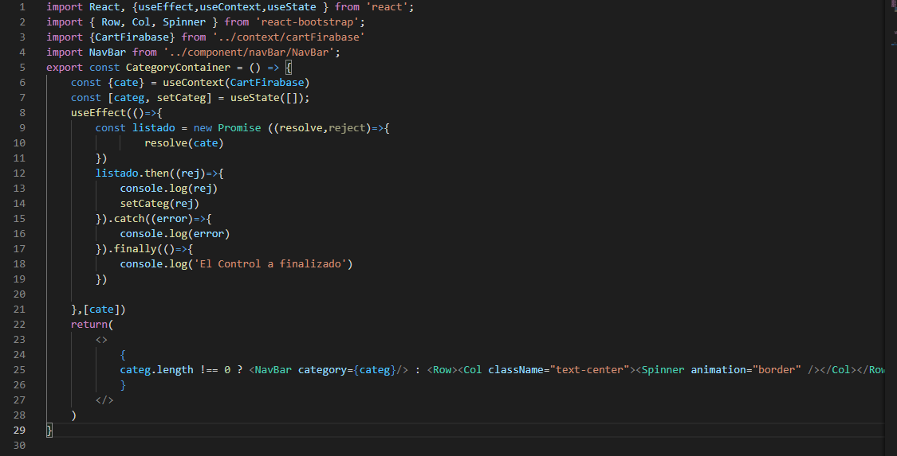

modifique el cart, trae todos los datos de orden de compra (que en la clase anterior ya lo tenia echo), ademas le agrege la posibilidad de poder cambiar desde la orden la cantidad de productos que deseo por item y muestro un mensaje si la persona no a cargado nada en su orden de compra

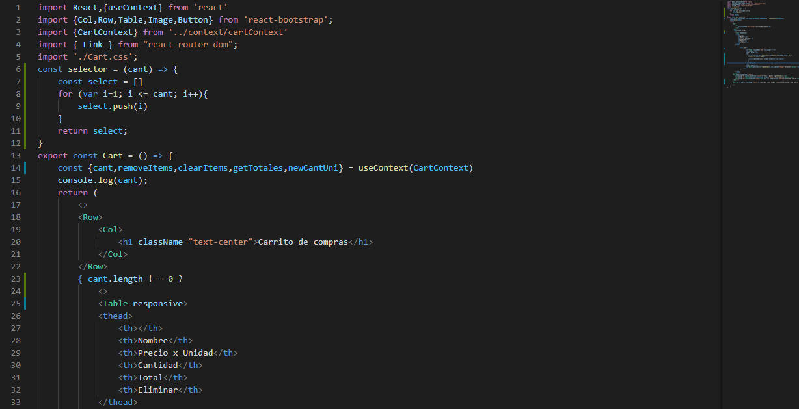

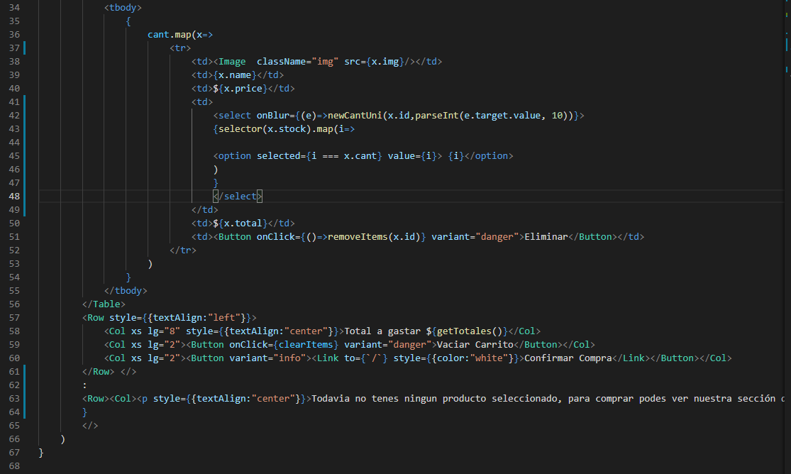

A continuacion dejo un gif de como esta funcionando el sitio.

